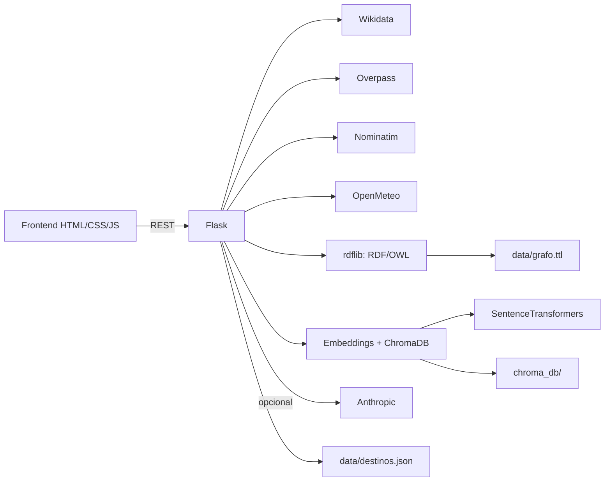

# TurismoSemántico 🗺️
**Plataforma Inteligente del Patrimonio Cultural de España**

Trabajo Final — Modelado Semántico de la Web

---

## Resumen
TurismoSemántico es una aplicación web que integra datos abiertos (Wikidata, OpenStreetMap y Open‑Meteo) para construir un grafo RDF/OWL del patrimonio cultural español, ofrecer búsqueda semántica por similitud y un asistente conversacional RAG. El objetivo es demostrar la conexión entre modelado semántico, APIs abiertas y técnicas actuales de recuperación de información en un entorno web interactivo.

---

## Tabla de contenidos
- [Objetivos](#objetivos)
- [Funcionalidades](#funcionalidades)
- [Tecnologías y fuentes de datos](#tecnologías-y-fuentes-de-datos)
- [Arquitectura y flujo de datos](#arquitectura-y-flujo-de-datos)
- [Requisitos](#requisitos)
- [Instalación](#instalación)
- [Configuración](#configuración)
- [Ejecución y uso rápido](#ejecución-y-uso-rápido)
- [API REST](#api-rest)
- [Datos y caché](#datos-y-caché)
- [Estructura del proyecto](#estructura-del-proyecto)
- [Evaluación rápida](#evaluación-rápida)
- [Notas y troubleshooting](#notas-y-troubleshooting)
- [Conexión con las prácticas](#conexión-con-las-prácticas)

---

## Objetivos
- Integrar fuentes abiertas para enriquecer el patrimonio cultural español.
- Construir una ontología RDF/OWL y exponer una consola SPARQL local.
- Ofrecer búsqueda semántica con embeddings y un chatbot RAG.
- Proveer una experiencia visual completa: mapa, filtros, grafo y clima.

---

## Funcionalidades
- **Explorador semántico**: mapa Leaflet con destinos de Wikidata y OpenStreetMap.
- **Buscador semántico**: SentenceTransformers + ChromaDB (fallback TF‑IDF si falla el modelo).
- **Chatbot RAG**: recuperación semántica + respuesta local o LLM (Anthropic opcional).
- **Grafo RDF/OWL**: visualización D3.js de tripletas y descarga Turtle.
- **Consola SPARQL local**: ejecución de consultas sobre el grafo en memoria.
- **Clima en tiempo real**: Open‑Meteo para coordenadas de cualquier destino.
- **POIs OSM por ciudad**: búsqueda por ciudad con Overpass + Nominatim.

---

## Tecnologías y fuentes de datos

**Stack principal**
- Backend: Flask, rdflib, SPARQLWrapper.
- Semántica y RAG: SentenceTransformers, ChromaDB, spaCy (NER), Anthropic (opcional).
- Frontend: HTML/CSS/JS, Leaflet, D3.js.

**Fuentes abiertas**
| Fuente | URL | Requiere key |
|--------|-----|--------------|
| Wikidata SPARQL | https://query.wikidata.org/sparql | ❌ No |
| OpenStreetMap Overpass | https://overpass-api.de | ❌ No |
| OpenStreetMap Nominatim | https://nominatim.openstreetmap.org | ❌ No |
| Open‑Meteo (clima) | https://api.open-meteo.com | ❌ No |
| Anthropic API (chatbot) | https://api.anthropic.com | ✅ Opcional |

---

## Arquitectura y flujo de datos


**Pipeline de carga**
1. La UI dispara `/api/cargar` (datos frescos o caché).
2. Se consulta Wikidata (UNESCO, museos, destinos generales).
3. Se construye el grafo RDF y se serializa en `data/grafo.ttl`.
4. Se generan embeddings y se indexan en `chroma_db/`.
5. OpenStreetMap se completa en **segundo plano** si la caché es incompleta.

Si existe `data/destinos.json`, la app puede arrancar desde caché y refrescar OSM en background.

---

## Requisitos
- Python **3.11** (probado).
- Conexión a Internet para cargar datos externos.
- Dependencias Python actualizadas en `requirements.txt` y `environment.yml` el **26/05/2026**.

---

## Instalación

### Opción A — venv (recomendado en Windows)
```bash
python -m venv .venv
# Windows:
.venv\Scripts\activate
# Linux/Mac:
source .venv/bin/activate
```

### Opción B — conda (usa environment.yml)
```bash
conda env create -f environment.yml
conda activate turismo_semantico
```

### Instalar dependencias
```bash
python -m pip install --upgrade pip
pip install -r requirements.txt
```

---

## Configuración

### spaCy NER (opcional pero recomendado)
```bash
python -m spacy download es_core_news_md
python -m spacy validate
```
Si no instalas el modelo, el NER se desactiva y el buscador sigue funcionando.

### Variables de entorno (opcional)
```bash
# Windows:
set ANTHROPIC_API_KEY=tu_api_key_aqui
set ANTHROPIC_MODEL=claude-3-5-haiku-20241022
set FLASK_DEBUG=1
set PORT=5000

# Linux/Mac:
export ANTHROPIC_API_KEY=tu_api_key_aqui
export ANTHROPIC_MODEL=claude-3-5-haiku-20241022
export FLASK_DEBUG=1
export PORT=5000
```
Sin API key, el chatbot responde en modo local usando el contexto recuperado.
`FLASK_DEBUG` es opcional; por defecto la app arranca sin modo debug.

---

## Ejecución y uso rápido
```bash
python app.py
```
Abre tu navegador en **http://localhost:5000**.

1. Pulsa **Cargar datos frescos (APIs)** o **Usar caché local**.
2. Explora el mapa, el buscador semántico y el chatbot.
3. Abre la sección **Grafo RDF** para ver tripletas.
4. Ejecuta consultas en la **Consola SPARQL**.

---

## API REST

| Método | Endpoint | Descripción |
|--------|----------|-------------|
| GET | `/` | Frontend principal |
| GET | `/api/estado` | Estado de carga, OSM y embeddings |
| POST | `/api/cargar` | Inicia carga (`{ forzar: true/false }`) |
| GET | `/api/destinos` | Lista de destinos (`tipo`, `limite`) |
| GET | `/api/buscar` | Búsqueda semántica (`q`, `k`) |
| GET | `/api/clima` | Clima (`lat`, `lon`) |
| GET | `/api/overpass` | POIs OSM por ciudad (`ciudad`, `radio`) |
| POST | `/api/chat` | Chat RAG (`{ pregunta }`) |
| GET | `/api/grafo` | Tripletas para visualización |
| GET/POST | `/api/sparql` | SPARQL local (`q` o `{ query }`) |
| GET | `/api/shacl` | Shapes SHACL (`?validar=1` valida el grafo) |
| GET | `/api/ttl` | Descarga del grafo Turtle |

---

## Datos y caché
- `data/destinos.json`: caché de destinos fusionados (Wikidata + OSM).
- `data/grafo.ttl`: grafo RDF serializado en Turtle.
- `chroma_db/`: persistencia de embeddings.

Para forzar una regeneración completa:
1. Pulsa **Cargar datos frescos**.
2. (Opcional) elimina `data/` y `chroma_db/`.

---

## Estructura del proyecto
```
ProjectoFinal_MSW_TurismoSemantico/
├── app.py                    ← Servidor Flask (rutas y orquestación)
├── pipeline/
│   ├── __init__.py
│   ├── wikidata.py           ← Consultas SPARQL a Wikidata
│   ├── overpass.py           ← Overpass + Nominatim (OSM)
│   ├── weather.py            ← Open‑Meteo (clima)
│   ├── rdf_model.py          ← Ontología RDF/OWL + SHACL
│   └── embeddings.py         ← ChromaDB + SentenceTransformers + RAG
├── templates/
│   └── index.html            ← Frontend principal
├── static/
│   ├── css/style.css
│   └── js/app.js             ← Leaflet, D3.js, lógica frontend
├── data/
│   ├── destinos.json         ← Caché de destinos fusionados
│   └── grafo.ttl             ← Grafo RDF serializado
├── chroma_db/                ← Persistencia de embeddings
├── requirements.txt
└── environment.yml
```

---

## Evaluación rápida
1. Ejecuta `python app.py`.
2. En la UI, pulsa **Cargar datos frescos (APIs)**.
3. Verifica:
	 - Mapa con destinos y filtros por tipo.
	 - Búsqueda semántica con resultados y similitud.
	 - Chatbot con respuesta basada en el contexto recuperado.
	 - Grafo RDF con tripletas y descarga `.ttl`.
	 - Consola SPARQL con consultas de ejemplo.

---

## Notas y troubleshooting
- **Embeddings lentos**: la primera indexación puede tardar varios minutos en CPU.
- **Modelo de embeddings sin descargar o sin acceso a Hugging Face**: la app no se cae; activa búsqueda TF-IDF/Jaccard como fallback.
- **Sin spaCy**: el NER se desactiva, pero la búsqueda funciona igual.
- **Sin Anthropic**: el chatbot responde en modo local con destinos recuperados.
- **Validación SHACL**: `/api/shacl?validar=1` usa pySHACL si está instalado y mantiene una comprobación local de fallback.
- **Sin datos**: si ves “Datos no cargados”, pulsa “Cargar datos frescos”.
- **OSM lento**: Overpass puede responder lento; la carga OSM se completa en background.
- **Tras actualizar ChromaDB**: si el índice persistido no coincide con la versión instalada, elimina `chroma_db/` y vuelve a cargar datos para regenerarlo.

---

## Conexión con las prácticas

| Práctica | Tecnología usada en el proyecto |
|----------|--------------------------------|
| P1-P4    | JSON en pipeline de ingesta y caché |
| P5       | Patrón API REST (múltiples APIs externas) |
| P6       | Ontología RDF/OWL en `rdf_model.py` |
| P7       | SPARQL a Wikidata + consola local |
| P8       | Shapes SHACL en `rdf_model.py` |
| P9       | NER con spaCy en `embeddings.py` |
| P10      | Word Embeddings + similitud coseno |
| P11      | RAG completo: ChromaDB + LLM opcional |
